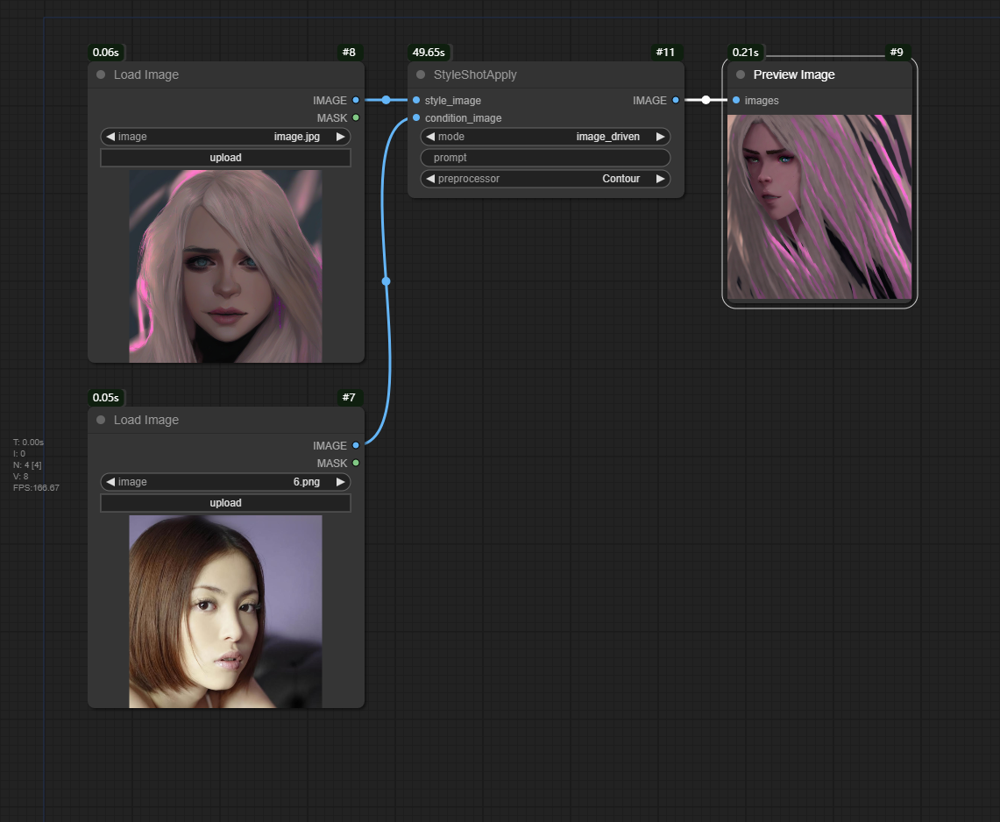

# ComfyUI-StyleShot

This project integrates [StyleShot](https://github.com/open-mmlab/StyleShot/) functionality into ComfyUI, thanks to the foundational work by continue-revolution.


You can refer to this example workflow for a quick start.

## Requirements

Install the necessary Python dependencies using the following command:
```sh
pip3 install -r requirements.txt
```

## Parameters

### Mode
- **Description**: The mode of operation for the style transfer. Options include "text_driven", "image_driven", "controlnet", and "t2i-adapter".
- **Type**: `str`
- **Default**: "text_driven"

### Style Image
- **Description**: The style image that will be used to transfer its style to the content image.
- **Type**: [`PIL.Image`] or [`numpy.ndarray`]
- **Default**: None

### Condition Image
- **Description**: The condition image that will be used in certain modes like "image_driven" and "controlnet".
- **Type**: [`PIL.Image`] or [`numpy.ndarray`]
- **Default**: None

### Prompt
- **Description**: A textual description or prompt that guides the style transfer process.
- **Type**: `str`
- **Default**: ""

### Preprocessor
- **Description**: The preprocessor to use for the style transfer. Options include "Contour" and "Lineart".
- **Type**: `str`
- **Default**: "Contour"

## Contribution

Thank you for considering contributing! Please fork this repository, make your changes, and submit a pull request for review and merging.
